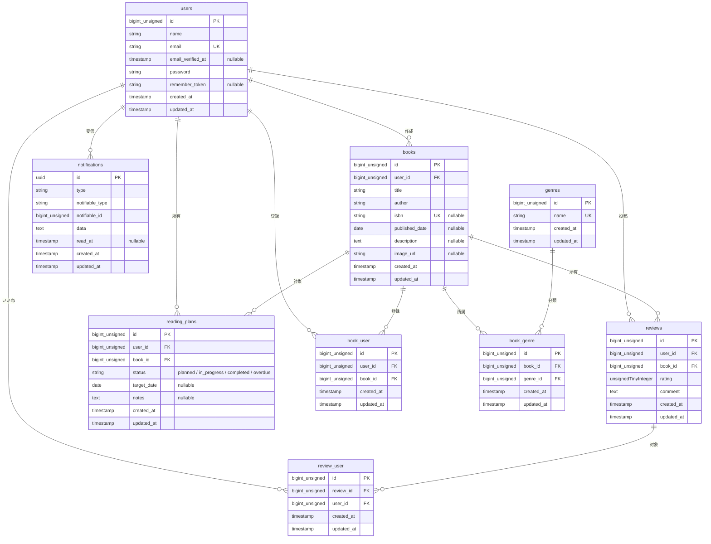

# BookShelf 書籍レビューアプリ

書籍の登録・管理・検索をはじめ、レビュー投稿や読書計画の作成・レポート出力・リマインダー通知などができるWebアプリケーションです。

---

## 概要

### プロジェクトの目的
読者同士が書籍情報を共有し、自身の読書習慣や進捗を管理・視覚化することを目的として開発されたアプリケーションです。

### 実装機能一覧
- **認証機能**: ユーザー新規登録、ログイン・ログアウト、SanctumによるAPI認証
- **書籍管理**: 書籍の一覧・詳細・作成・編集・削除、ISBNコードによる外部API自動取得機能
- **検索・ソート**: タイトル・著者名によるフィルタリングおよび各種ソート
- **レビュー・お気に入り**: 書籍へのレビュー投稿・編集・削除、いいね機能、お気に入り登録
- **ジャンル・ランキング**: ジャンル別管理、人気書籍のランキング表示
- **読書計画・レポート**: 読書計画の作成・更新・削除・完了（読了）切り替え、マイ読書レポート（月別読了数等の集計）
- **通知・自動処理**: 期限切れ計画の自動失効、リマインダー通知および通知既読処理


## 環境構築手順

1. リポジトリをクローンする

```bash
git clone〈リポジトリのURL〉
cd bookshelf-app
```

2. `.env`を用意し、必要な環境変数を設定する

```bash
cp .env.example .env
```
※.env内のGOOGLE_BOOKS_API_KEYに、取得したGoogle Books APIキーを設定してください。

3. 依存パッケージをインストールする（初回は `vendor` がないため Docker 経由で実行）

 ```bash
   docker run --rm \
       -u "$(id -u):$(id -g)" \
       -v "$(pwd):/var/www/html" \
       -w /var/www/html \
       laravelsail/php85-composer:latest \
       composer install --ignore-platform-reqs
   ```

4. コンテナを起動する

```bash
./vendor/bin/sail up -d
```

5. アプリケーションキーを生成する
 ```bash
   ./vendor/bin/sail artisan key:generate
```

6. マイグレーションと初期データを投入する
```bash
   ./vendor/bin/sail artisan migrate:fresh --seed
```

7. フロントエンドをビルドする
```bash
   ./vendor/bin/sail npm install
   ./vendor/bin/sail npm run dev
```

8. ブラウザで http://localhost にアクセスする

## 開発環境 URL

- アプリケーション: http://localhost
- APIベースURL: http://localhost/api/v1
- phpMyAdmin: http://localhost:8080

## テストの実行

```bash
./vendor/bin/sail artisan test
./vendor/bin/sail artisan test --coverage --min=80
```

## 使用技術
- 言語/フレームワーク: PHP 8.5.1 / Laravel 10.x
- データベース: MYSQL 8.4.8
- 開発環境/開発ツール: Docker / Docker Compose / Laravel Sail / phpMyAdmin
- 認証スタック: Laravel Fortify / Laravel Sanctum(API)
- フロントエンド: Tailwind CSS / Vite
- テスト環境: PHPUnit

## 公開 API エンドポイント
| メソッド | パス | 概要 | 認証 |
|----------|------|------|------|
| GET | `/api/v1/books` | 書籍一覧取得 | 不要 |
| GET | `/api/v1/books/{book}` | 書籍詳細取得 | 不要 |
| GET | `/api/v1/user` | ログインユーザー取得 | **要**(Sanctum) |
| POST | `/api/v1/books` | 書籍登録 | **要**(Sanctum) |
| PUT | `/api/v1/books/{book}` | 書籍更新 | **要**(Sanctum) |
| DELETE | `/api/v1/books/{book}` | 書籍削除 | **要**(Sanctum) |

**※API認証について**

要認証のエンドポイントを呼び出す際は、ログイン（またはトークン発行）後に取得したBearer トークンを `Authorization: Bearer <トークン>` ヘッダーに付与してリクエストを送信してください。


## ER図



## 作成者

氏名: 理﨑 加奈
